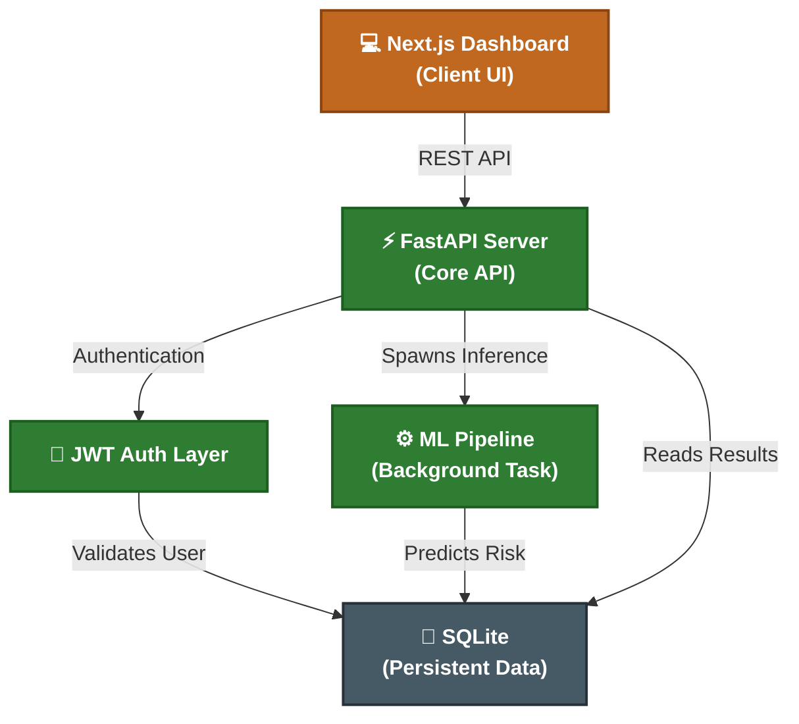
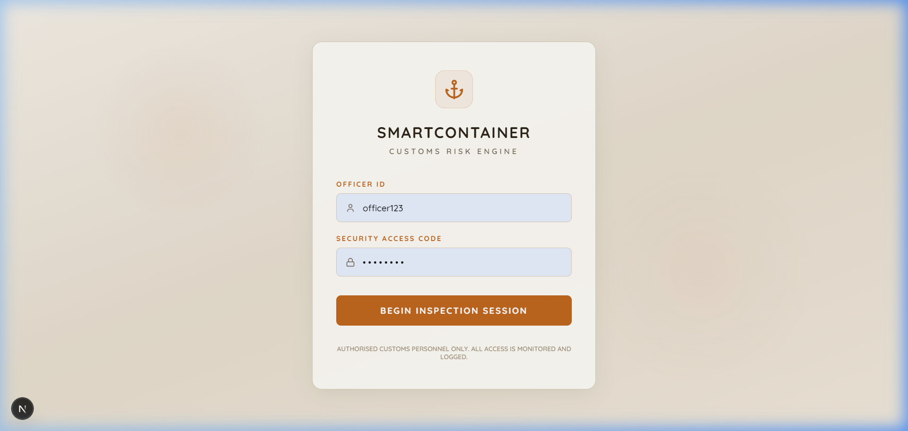

<div align="center">
  
  <h1 align="center">SmartContainer Risk Engine v4.0</h1>
  <p align="center">
    <strong>Next-Generation AI Customs Intelligence & Targeting Platform</strong>
    <br />
    <br />
    <a href="#-solution-overview">Overview</a>
    ·
    <a href="#-architecture">Architecture</a>
    ·
    <a href="#-tech-stack">Tech Stack</a>
    ·
    <a href="#-live-demo--screenshots">Screenshots</a>
  </p>
</div>

<hr />

## 🌟 Solution Overview

The **SmartContainer Risk Engine** is an enterprise-grade, microservices-based application designed for modern customs agencies. It ingest vast amounts of shipping manifest data, utilizes Isolation Forest anomaly detection algorithms, and evaluates cargo risk in real-time.

By intelligently parsing manifest data, dwelling times, declared weights vs. actual weights, and historical trade patterns, the system automatically triages incoming shipments into **Low**, **Medium**, and **Critical** risk tiers—enabling customs officers to focus physical inspections exactly where they are needed most.

### Key Capabilities

- 🔥 **Real-time Anomaly Detection**: Statistical anomaly flagging using AI/ML algorithms.
- 👨‍⚖️ **Role-Based Access Control (RBAC)**: Distinct permissions for `Admin`, `Officer`, and `Pending` users.
- 📊 **Dynamic Analytics Dashboard**: Rich data visualizations built with Recharts.
- 💨 **In-Process Background Tasks**: Fast execution of ML inference without external brokers.
- 🛡️ **JWT Authentication**: Secure, token-based API communication.

---

## 🏗️ Architecture

The system is built on a decoupled, asynchronous microservices architecture to ensure high throughput and independent scaling of the intelligence tier.



---

## 💻 Tech Stack

### Frontend Application

- **Framework**: [Next.js 14+ (App Router)](https://nextjs.org/)
- **UI Library**: [React 18](https://react.dev/)
- **Styling**: Native CSS via Design System Tokens
- **Icons**: [Lucide React](https://lucide.dev/)
- **Data Parsing**: [PapaParse](https://www.papaparse.com/) (Client-side CSV manipulation)
- **Charts**: [Recharts](https://recharts.org/)

### Backend Service

- **Framework**: [FastAPI](https://fastapi.tiangolo.com/) (High performance async Python framework)
- **Database ORM**: [SQLAlchemy](https://www.sqlalchemy.org/)
- **Authentication**: `python-jose` (JWT) & `passlib[bcrypt]`
- **Task Queue**: [Celery](https://docs.celeryq.dev/)
- **Message Broker**: [Redis](https://redis.io/)
- **Machine Learning**: `scikit-learn` (Isolation Forest) & `pandas`

---

## 📸 Live Demo & Screenshots

### Demo Credentials

To explore the system locally, use the following seeded administrator credentials:

- **Officer ID (Username)**: `testadmin`
- **Security Access Code (Password)**: `password123`

### 1. Secure Authentication Portal

_Role-based access gateway for customs personnel._


### 2. High-Level Intelligence Overview

_Real-time metrics tracking flagged shipments, anomalies, and active system health._


### 3. Container Risk Registry

_Detailed triage view featuring the dynamic `RiskBar` component with deep ML scoring._


---

## 🚀 Getting Started

### Prerequisites

- Python 3.9+
- Node.js 18+

### Installation

**1. Clone the repository**

```bash
git clone https://github.com/Priyansh9506/Prototype-Zero-v2.git
cd Prototype-Zero-v2
```

**2. Setup Backend (FastAPI)**

```bash
python -m venv venv
source venv/bin/activate  # Or `venv\Scripts\activate` on Windows
pip install -r requirements.txt
python verify_user.py      # Seed the admin database
python -m uvicorn api.main:app --reload
```

**3. Setup Frontend (Next.js)**

```bash
cd dashboard
npm install
npm run dev
```

**4. Access the Dashboard**
Navigate your browser to `http://localhost:3000`.

---

<div align="center">
  <sub>Built with precision for global supply chain security.</sub>
</div>
